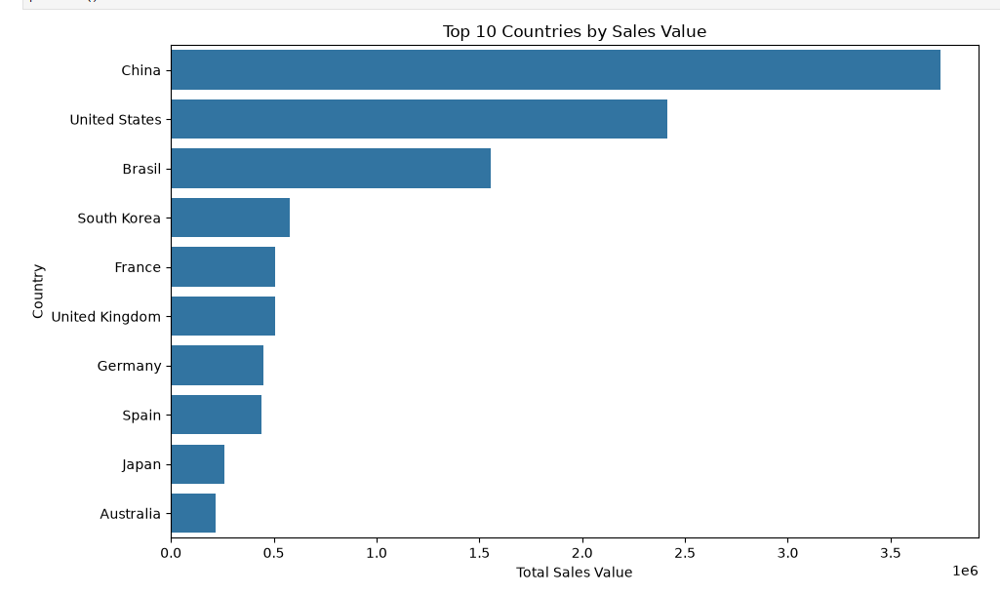
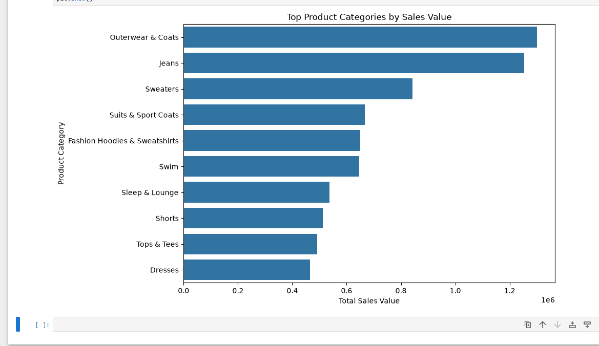
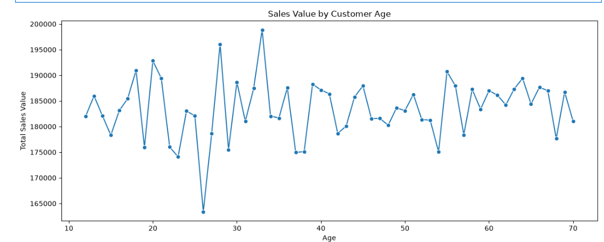

# 📊 Looker E-Commerce End-to-End Data Analysis

<div align="center">
  <a href="https://github.8com/Mahmoud976/big-data-engineering/releases">
    
  </a>
  <a href="./LICENSE">
    
  </a>
  
  
</div>

## 👥 Team Members
- **Ahmad Alaa Abdelaziz Mahmoud**
- **Mahmoud Mohamed El-sayed Saleh**

## 📝 Project Overview
This project focuses on the **Data Cleaning, Feature Engineering, and Exploratory Data Analysis (EDA)** of the Looker E-commerce Dataset sourced from Kaggle. The goal is to clean transactional data, handle edge cases, engineer time-based features, and extract actionable business insights regarding order statuses, high-value products, customer demographics, and regional performance.

## 💾 Dataset Source
The dataset used in this analysis is the [Looker E-commerce BigQuery Dataset](https://kaggle.com) on Kaggle.

---

## ⚙️ Operational Architecture & Pipeline

The following diagram illustrates the structured pipeline implemented in our code to process, clean, and analyze the E-commerce data from raw input to final business visualization:

```text
[ Raw CSV Files ] 
       │   (order_items.csv, users.csv, products.csv)
       ▼
┌────────────────────────────────────────────────────────┐
│ 1. DATA VALIDATION & CLEANING                          │
│    ├── Type Conversion: Object -> datetime64[ns, UTC]   │
│    ├── Integrity Check: Unique transaction validation   │
│    └── Logical Filtering: Removing future/invalid dates │
└────────────────────────────────────────────────────────┘
       │
       ▼
┌────────────────────────────────────────────────────────┐
│ 2. FEATURE ENGINEERING                                 │
│    ├── shipping_duration_days = shipped_at - created_at│
│    └── delivery_duration_days = delivered_at - shipped_at│
└────────────────────────────────────────────────────────┘
       │
       ▼
┌────────────────────────────────────────────────────────┐
│ 3. DATA MERGING & AGGREGATION                          │
│    └── Inner Join: order_items ⟵ products ⟵ users      │
└────────────────────────────────────────────────────────┘
       │
       ▼
┌────────────────────────────────────────────────────────┐
│ 4. EXPLORATORY DATA ANALYSIS (EDA)                     │
│    ├── Business KPI Calculations                       │
│    └── Advanced Visualizations & Insights Generation   │
└────────────────────────────────────────────────────────┘
       │
       ▼
[ Final Business Insights & Actionable Reports ]
```
---

## 🔍 Key Data Engineering Steps & Algorithms

### 1. Robust Data Validation
* **Uniqueness:** Verified that `id` serves as a stable primary key with zero duplicates across `181,759` records.
* **Logical Constraints:** Implemented an algorithm to validate time sequences. Records where chronological sequences were violated (e.g., `delivered_at` before `created_at`) were flagged or filtered to avoid logical errors in the duration metrics.

### 2. Time-Based Feature Engineering
We engineered critical operational KPIs using the following time-delta logic:
* **Shipping Latency:** `df['shipping_duration_days'] = (df['shipped_at'] - df['created_at']).dt.days`
* **Delivery Latency:** `df['delivery_duration_days'] = (df['delivered_at'] - df['shipped_at']).dt.days`

### 3. Structural Data Merging
Executed optimized `pandas.merge()` inner joins to unify the transaction database with customer profiles and the product catalog, standardizing the columns names into a clean, analytical schema:
- `category` ⟶ `prod_category`
- `Name` ⟶ `customer_name`
- `name` ⟶ `prod_name`

---

## 📊 Key Visualizations & Business Insights

### 1. Top 10 Countries by Sales Value
**China** and the **United States** dominate the global market by a massive margin. Targeted marketing campaigns and logistics optimization should be heavily focused on these two primary regions.
<p align="center">
  
</p>

### 2. Top Product Categories by Sales Value
**Outerwear & Coats** along with **Jeans** generate the highest revenue. Inventory stocking and seasonal promotions should prioritize these high-performing product lines.
<p align="center">
  
</p>

### 3. Sales Value by Customer Age
The distribution chart shows highly consistent purchasing behavior across all age demographics from **20 to 70 years old**. This indicates a very broad market appeal, proving that the product catalog successfully satisfies a diverse age range rather than a single niche.
<p align="center">
  
</p>

---

## 🛠️ Tech Stack & Dependencies
To replicate this environment locally, install the required packages:
```bash
pip install -r requirements.txt
```
- **Python 3.9+**
- **Pandas** (Data Wrangling)
- **Matplotlib & Seaborn** (Data Visualization)

---

## 📄 License
This project is licensed under the MIT License - see the [LICENSE](LICENSE) file for details.
