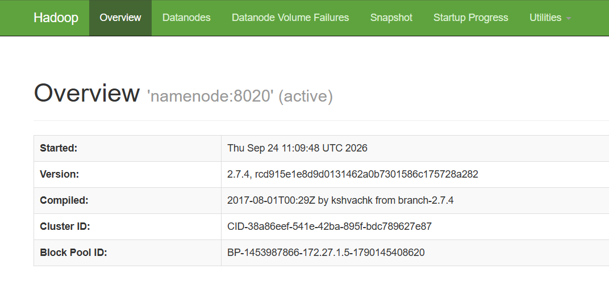
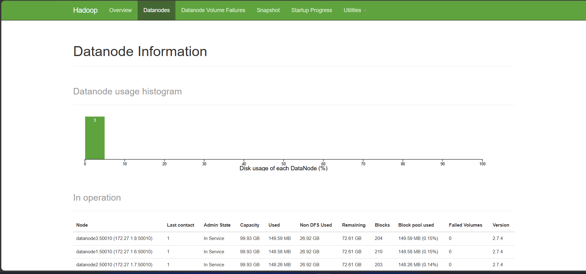
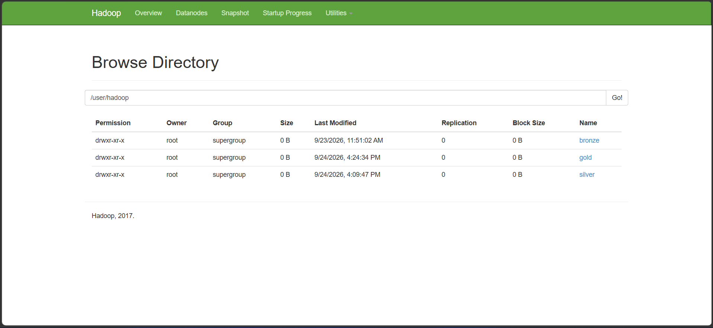
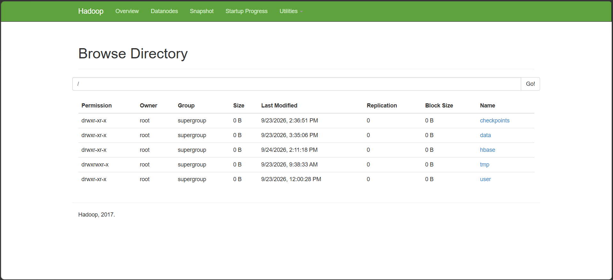
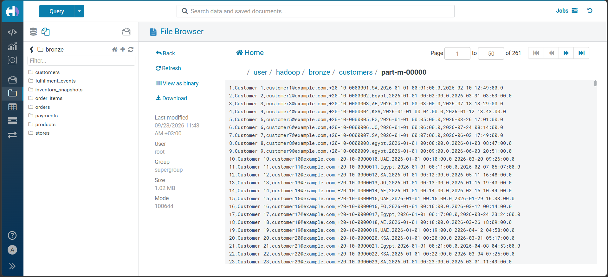
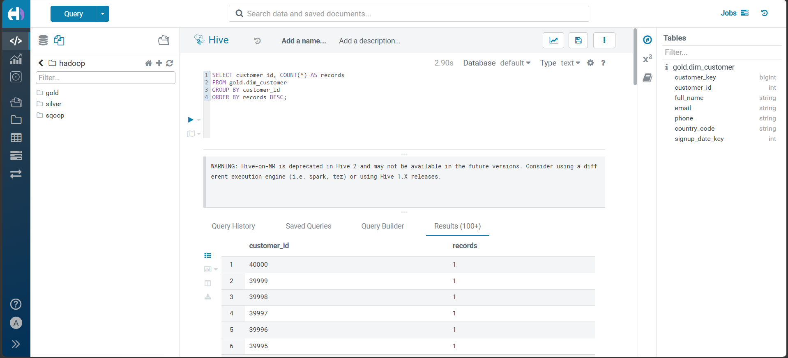
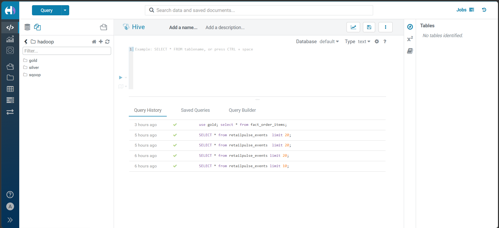
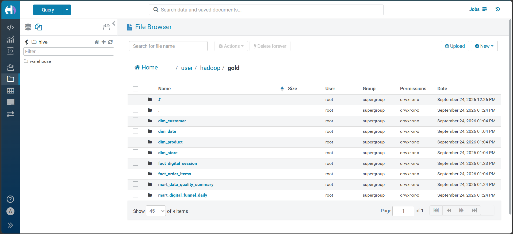
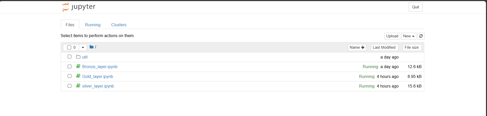
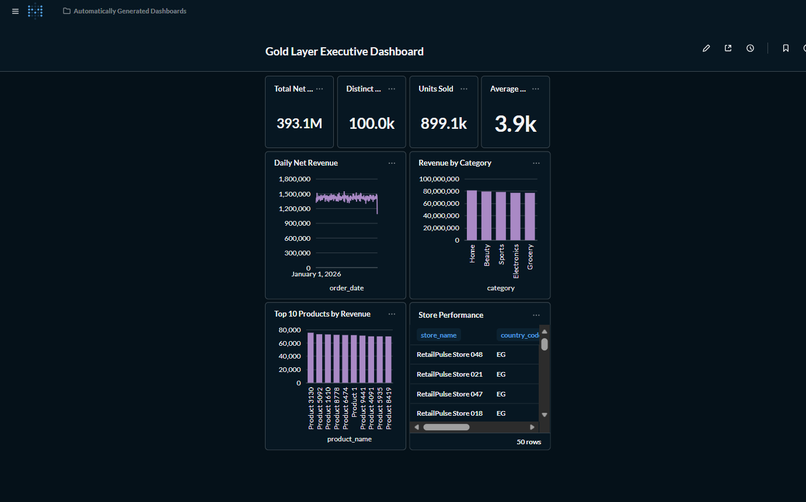

# Docker Big Data Tools
:information_source: **This docker-compose file is configured to run multiple nodes.**


This is a Hadoop Cluster that contains the necessary tools that can be used in the BigData domain. The Compose stack is organized into profiles so the core Hadoop storage group starts by default and the other groups can be started only when needed.


* **Hive** 
* **Hue**
* **MySql**
* **Zookeeper**
* **Kafka**
* **Hbase**
* **Metabase**
* **Sqoop**
* **Flume**
* **Flink**
* **Jupyter Spark**

## Docker Images Used
- **namenode** : [fjardim/namenode_sqoop ](https://hub.docker.com/r/fjardim/namenode_sqoop)
- **datanode** : [fjardim/datanode ](https://hub.docker.com/r/fjardim/datanode)
- **hive-server** : [fjardim/hive](https://hub.docker.com/r/fjardim/hive)
- **hive-metastore** : [fjardim/hive](https://hub.docker.com/r/fjardim/hive)
- **hive-metastore-postgresql** : [fjardim/hive-metastore](https://hub.docker.com/r/fjardim/hive-metastore)
- **hue** : [fjardim/hue](https://hub.docker.com/r/fjardim/hue)
- **hue_metadata_database** : [fjardim/mysql](https://hub.docker.com/r/fjardim/mysql/)
- **zookeeper** : [fjardim/zookeeper](https://hub.docker.com/r/fjardim/zookeeper)
- **kafka** : [fjardim/kafka](https://hub.docker.com/r/fjardim/kafka)
- **presto-coordinator** : [fjardim/prestodb](https://hub.docker.com/r/fjardim/prestodb)
- **hbase-master** : [fjardim/hbase-master](https://hub.docker.com/r/fjardim/hbase-master)
- **kafkamanager** : [fjardim/kafkamanager](https://hub.docker.com/r/fjardim/kafkamanager)
- **metabase** : [metabase/metabase](https://hub.docker.com/r/metabase/metabase)
- **flink** : [flink:1.20.3-scala_2.12-java17](https://hub.docker.com/_/flink)
- **sqoop** : [fjardim/namenode_sqoop](https://hub.docker.com/r/fjardim/namenode_sqoop)
- **flume** : [probablyfine/flume](https://hub.docker.com/r/probablyfine/flume)
- **jupyter-spark** : [fjardim/jupyter-spark](https://hub.docker.com/r/fjardim/jupyter-spark)
---
## Installation and startup groups
```bash=
git clone https://gitlab.com/ZakariaMahmoud/docker-bigdata-tools.git

cd docker-bigdata-tools

docker compose up -d
```
The default command starts only **Group 1**, which contains ZooKeeper, the NameNode, and the three DataNodes.

To start every group and all services at once:

```bash
docker compose --profile "*" up -d
```

Start the other groups when needed:

```bash
# Group 2: Hive and Presto query services
docker compose --profile hive-query up -d

# Group 3: Hue and its MySQL metadata database
docker compose --profile hue up -d

# Group 4: Jupyter Spark and Flink
docker compose --profile notebooks-stream-processing up -d

# Group 5: HBase
docker compose --profile hbase up -d

# Group 6: Sqoop and Flume
docker compose --profile data-ingestion up -d

# Group 7: Kafka and Kafka Manager
docker compose --profile kafka-monitoring up -d

# Group 8: Metabase
docker compose --profile analytics up -d
```

Profiles include Group 1 automatically, so every command keeps the core Hadoop group available. Stop an individual group with its service names, for example:

```bash
docker compose stop metabase
docker compose stop kafka kafkamanager
```

> ⚠️ **It takes some time to launch and configure all the images.**

## Screenshots
### **Namenode**
- **URL** : http://localhost:50070/



> 👁️ You can see here 3 Live Nodes








### **Datanode 1**
- **URL** : http://localhost:50075/


### **Datanode 2**
- **URL** : http://localhost:50080/


### **Datanode 3**
- **URL** : http://localhost:50085/


### **Hue**
- **URL** : http://localhost:8888/

**Username : admin**
**Password : admin**

**Hue Table Customer**


**Hue Query 2**


**Now you can use Hive**

### Query Examples

**Query 2: Top customers by frequency**
This query counts how many records exist for each customer and sorts them from highest to lowest frequency.

```sql
SELECT customer_id, COUNT(*) AS records
FROM gold.dim_customer
GROUP BY customer_id
ORDER BY records DESC;
```

**Query 1: Top products by frequency**
This query counts how many records exist for each product and ranks them by the most frequent items.

```sql
SELECT product_id, COUNT(*) AS records
FROM gold.dim_product
GROUP BY product_id
ORDER BY records DESC;
```

**Hue Query 1**


- After insert data you can execute select query.

**Hue Query History**


**Hue Dashboard**


## kafka Manager
- **URL** : http://localhost:9000/


## Cluster Overview
- **URL** : http://localhost:8080/


## Hbase
- **URL** : http://localhost:16010/


## Jupyter
- **URL** : http://localhost:8889/



## Flink
- **URL** : http://localhost:8082/

## Flume
- **TCP input** : localhost:44444

## Metabase
- **URL** : http://localhost:3000/

**Metabase Dashboard**

---
## Created by

* **Eng/** **Mahmoud Saleh**
* **Ahmed Khaled**
* **Abdullah Ayman**
* **Ahmed Alaa**
* **Karim Hany**
* **Abdullah Shaban**
