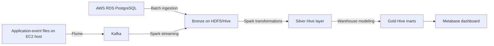
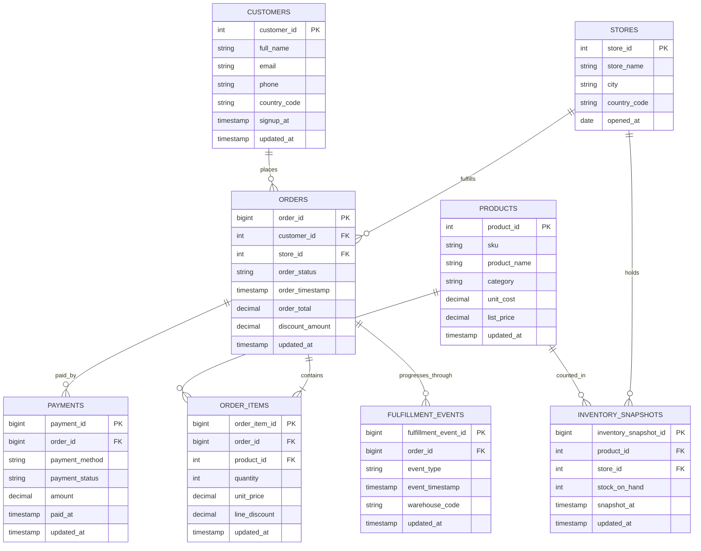

# RetailPulse Capstone: Retail Analytics

> [!abstract] Mission
> Build the first trusted analytical platform for RetailPulse: batch and streaming data in, governed Hive marts out, and a business-ready Metabase dashboard at the end.

---

## Business context

RetailPulse is a regional retailer with 50 physical stores and digital sales through web and mobile applications. Operations currently depend on a transactional PostgreSQL system for orders and inventory, while the digital product produces application events continuously. Reporting is fragmented, slow, and cannot reliably answer cross-channel questions.

You are the data engineering team responsible for building the first analytical platform for RetailPulse. The platform must combine batch operational data and streaming application data, create a governed Hive warehouse using medallion architecture, and provide a Metabase dashboard for business users.

## Your objective

Design, implement, and demonstrate an end-to-end pipeline that delivers trusted retail analytics.

Your final solution must use:

- Apache Sqoop for relational batch ingestion.
- Apache Flume and Apache Kafka for application-event ingestion.
- Apache Spark for processing the Kafka stream and performing transformations.
- Apache Hive on HDFS for the Bronze, Silver, and Gold layers.
- Metabase for the final dashboard.

Do not use Airflow, Elasticsearch, or Flink.

> [!warning] Scope boundary
> The required tools are Sqoop, Flume, Kafka, Spark, Hive/HDFS, and Metabase. You must design the configurations and implementation yourself.

---

## Operating environment

Each student receives an EC2 instance with a cloned `Docker-BigData-Tools` repository. The Docker Compose environment contains the services needed for this assignment, including HDFS, Hive, Sqoop, Flume, Kafka, Spark, and Metabase.

The repository itself is the runtime bootstrap and must remain unchanged. Keep your capstone artifact files in a separate sibling folder such as `~/Capstone_RetailPulse`, and use the repo's existing mounted directories only for data and container access.

The existing Flume lab data directory on the EC2 host is already mounted into the Flume container. Application-event files must be produced in that host directory structure so that Flume can read them from inside its container. Keep your implementation compatible with this existing mount.

The instructor provisions the PostgreSQL source schema on the course AWS RDS instance. Use the same approved connection and certificate approach used in the Sqoop lab. 

### PostgreSQL connection reference

> [!info] Course AWS RDS source
> | Setting | Value |
> |---|---|
> | Host | `nti-labs.cih6ce2ewr0r.us-east-1.rds.amazonaws.com` |
> | Port | `5432` |
> | Database | `NTI` |
> | Schema | `capstone_retail` |
> | Username | `postgres` |
> | Password | `12345678` |
> | SSL mode | `verify-full` |
> | Root certificate | `global-bundle.pem` |

> [!tip] Connection requirement
> Your Sqoop implementation must use the PostgreSQL JDBC driver, SSL verification, the supplied AWS RDS root certificate, and the `capstone_retail` schema. Adapt the JDBC connection pattern from the Sqoop lab to this schema.

---

## Target architecture

Your architecture must implement the following data flow. You are responsible for choosing the detailed configuration, topic design, HDFS paths, table definitions, file formats, partitions, checkpoints, and rerun strategy.

> [!question] Design decisions you own
> Select the Kafka topic name, partitions, message key, Flume source/channel/sink behavior, HDFS locations, file formats, Hive partitions, Spark checkpoint location, and rerun strategy. Defend each choice in your README.

---

## Source system: PostgreSQL

The instructor creates the `capstone_retail` PostgreSQL schema. It represents an operational retail system, not an analytical warehouse. Its tables are normalized and should not be copied unchanged into Gold.

Expected starting scale:

| Entity | Approximate rows |
|---|---:|
| Stores | 50 |
| Customers | 40,000 |
| Products | 10,000 |
| Orders | 100,000 |
| Order items | 200,000 to 400,000 |
| Payments | 100,000 |
| Fulfillment events | 300,000 |
| Inventory snapshots | 100,000 |

> [!important] Modeling expectation
> This is an OLTP source model. Gold must be a business-oriented warehouse model, not a copy of the PostgreSQL tables.

### Operational data model

### Source-table purpose

| Table | Operational purpose | Primary analytical use |
|---|---|---|
| `stores` | Master record for each retail store. | Store dimension. |
| `customers` | Customer registration and contact profile. | Customer dimension and segmentation. |
| `products` | Product catalogue, category, cost, and list price. | Product dimension and margin analysis. |
| `orders` | Order header, customer, store, status, and total. | Order-level analysis. |
| `order_items` | Individual products and quantities within an order. | Atomic sales fact. |
| `payments` | Payment method, status, and amount for an order. | Payment and collection analysis. |
| `fulfillment_events` | Operational milestones from warehouse to delivery. | Delivery SLA and order-lifecycle analysis. |
| `inventory_snapshots` | Point-in-time stock balance by product and store. | Low-stock and inventory-risk analysis. |

---

## Streaming application events

The digital application writes newline-delimited JSON event files on the EC2 host. Your event generator must be placed and executed beside the existing `generate_flume_logs.py` file in the cloned `Docker-BigData-Tools` repository. It must write completed files under the existing Flume lab data directory, in a dedicated RetailPulse subdirectory.

Each valid event represents one user action. The expected business attributes are:

| Attribute | Description |
|---|---|
| `event_id` | Identifier for one application event. |
| `event_type` | User or operational action, such as product view, cart update, checkout start, confirmed order, or fulfillment update. |
| `event_timestamp` | Time at which the application reports the event occurred. |
| `customer_id` | Customer associated with the activity, when available. |
| `session_id` | Digital session identifier. |
| `order_id` | Related order identifier for order or fulfillment events. |
| `product_id` | Product involved in the activity, when relevant. |
| `store_id` | Store responsible for the order or inventory context. |
| `channel` | Digital sales channel, such as web or mobile. |
| `sequence` | Generator sequence number used for traceability. |

Generate a meaningful volume of events for demonstration and produce multiple files rather than one monolithic file. Your pipeline must be able to process additional files after the initial run without rebuilding the entire platform.

> [!tip] Source contract
> Each line is one JSON event. Use the existing Flume lab mount and a dedicated RetailPulse subdirectory so the application-event source remains separate from other course exercises.

---

## Required medallion design

### Bronze: immutable landing layer

Bronze must retain source fidelity and be suitable for replay and audit.

- Land PostgreSQL source extracts in HDFS.
- Land Kafka application events with the raw payload and enough Kafka/ingestion metadata to trace each record.
- Do not apply business aggregations or silently discard source data in Bronze.
- Use a storage format and partition strategy appropriate for the scale and rerun requirements.

### Silver: cleansed and conformed layer

Silver must contain queryable, standardized, deduplicated data suitable for warehouse modelling.

- Parse application event JSON and isolate records that cannot be safely parsed.
- Define and implement duplicate-handling logic for streaming events.
- Preserve the difference between event time and ingestion time.
- Standardize attributes needed for reliable joins and reporting.
- Define validation rules for relational and streaming records, including how rejected records are retained and measured.
- Handle source entities that can change after their first ingestion.
- Document each rule, its rationale, and its impact on record counts.

### Gold: business-facing warehouse layer

Model Gold for analytical use rather than reproducing the operational source design.

At minimum, build:

- Customer dimension.
- Product dimension.
- Store dimension.
- Date dimension or an equivalent reusable date design.
- Atomic sales fact at the order-line grain.
- Fulfillment SLA mart or accumulating-process fact.
- Inventory-risk mart.
- Digital funnel mart.
- Data-quality summary mart.

For every Gold table, state the grain, business key, source tables, and refresh behavior. Explain how facts join to dimensions and how you prevent double counting.

> [!success] Gold-layer test
> A business user should be able to query Gold tables without knowing the source-system joins, data-quality rules, or Kafka payload structure.

---

## Business questions the dashboard must answer

Build a single Metabase dashboard backed by Hive Gold tables that answers:

1. What are daily net revenue, order count, and average order value?
2. Which stores and product categories generate the highest revenue?
3. What is the order and delivery lifecycle, and how many orders miss your defined delivery SLA?
4. Which products and stores have low inventory risk?
5. How does the digital funnel progress from product view to cart, checkout, and confirmed order?
6. What is the data-quality status of the pipeline, including rejected and duplicate records?

The dashboard must include sensible date filtering and labels that business users can understand. Define every calculated metric, especially net revenue, average order value, and late delivery.

---

## Engineering requirements

- Use a multi-partition Kafka topic and justify the partition count and message key strategy.
- Use Flume to transfer application-event files to Kafka.
- Use Spark streaming to consume Kafka and write to the Hive/HDFS pipeline.
- Use Sqoop to ingest all required PostgreSQL source tables and justify mapper count and split columns.
- Design initial and incremental ingestion behavior for the source tables.
- Use columnar storage for Silver and Gold.
- Partition high-volume Hive data where it improves the intended query patterns.
- Ensure re-running a job does not corrupt Gold reporting results.
- Keep credentials out of scripts, configuration files, and Git.

> [!check] Before submission
> Demonstrate an initial load, then add more source data or event files and demonstrate that your incremental/rerun design produces correct Gold results without duplication.

---

## Evidence and submission

Submit:

1. Architecture diagram with data flow, storage layers, and ownership of each tool.
2. Source-to-target mapping, including each Gold table's grain and join logic.
3. All code, configuration, SQL, and runbook material you created.
4. Data-quality rule catalogue with before/after counts and rejected-record locations.
5. Evidence of RDS ingestion, Kafka consumption, HDFS/Hive tables, and successful Spark processing.
6. Metabase dashboard screenshots or accessible dashboard link.
7. A short operational README explaining startup order, reruns, failure recovery, and lineage from each source to each dashboard metric.

## Assessment priorities

Assessment focuses on correct end-to-end integration, sensible warehouse modelling, reproducibility, data quality handling, and whether the Metabase dashboard answers the business questions using Hive-backed Gold data.